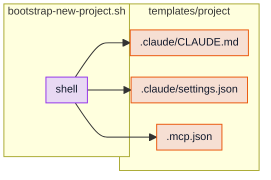

---
skills_invoked:
  - superpowers:brainstorming
  - superpowers:writing-plans
  - org-ai-tooling
  - simplify
  - plugin-dev:plugin-structure
  - plugin-dev:skill-development
---

# Bootstrap Cleanup Implementation Plan

> **For agentic workers:** REQUIRED SUB-SKILL: Use `superpowers:subagent-driven-development` (recommended) or `superpowers:executing-plans` to implement this plan. Steps use checkbox (`- [ ]`) syntax.
>
> **Skill-loading discipline (non-negotiable for any subagent dispatched against this plan):** Before any substantive work, invoke EVERY relevant skill via the `Skill` tool — breadth-first, exhaustive. Required set: `org-ai-tooling`, every `plugin-dev:*` skill, `simplify`, plus matching `superpowers:*` skills. Each subagent has its own context and must independently invoke the full set. Subagent artifacts MUST start with the YAML `skills_invoked:` frontmatter block. Log "Skills loaded: [list]" as the first line of substantive work.

**Goal:** Delete `plugin/scripts/bootstrap-new-project.sh` and the entire `plugin/templates/project/` tree. Preserve only the `.env`/secrets deny rules as a tiny README copy-paste block. Update 3 mermaid diagrams (delete one entirely). Mark followups item #4 RESOLVED. Single atomic commit.

**Architecture:** Single atomic commit (per spec §6). All deletions and `plugin/README.md` updates land together so the README never references files that no longer exist (or vice versa).

**Tech Stack:** Markdown + git + pnpm test (existing test suite, no new tests).

**Spec:** [`docs/superpowers/specs/2026-04-29-bootstrap-cleanup-design.md`](../specs/2026-04-29-bootstrap-cleanup-design.md).

---

## Pre-flight

- [ ] **Step 1: Confirm branch state**

```bash
git status && git log --oneline -1
```

Expected: branch `logan`, working tree clean (or spec/plan files only). Tip at commit `99f144d` ("docs(spec): bootstrap cleanup...") or later.

- [ ] **Step 2: Confirm targets exist**

```bash
ls plugin/scripts/bootstrap-new-project.sh plugin/templates/project/.mcp.json plugin/templates/project/.claude/CLAUDE.md plugin/templates/project/.claude/settings.json
```

Expected: all 4 files print without error. If any is missing, stop — the deletion premise is wrong.

---

## Task 1: Delete the bootstrap script and templates

**Files:**
- Delete: `plugin/scripts/bootstrap-new-project.sh`
- Delete: `plugin/templates/project/.mcp.json`
- Delete: `plugin/templates/project/.claude/CLAUDE.md`
- Delete: `plugin/templates/project/.claude/settings.json`

- [ ] **Step 1: Remove all 4 files in one operation**

```bash
git rm plugin/scripts/bootstrap-new-project.sh plugin/templates/project/.mcp.json plugin/templates/project/.claude/CLAUDE.md plugin/templates/project/.claude/settings.json
```

Expected output: 4 `rm '<path>'` lines.

- [ ] **Step 2: Confirm directories are gone**

```bash
ls plugin/scripts/ plugin/templates/ 2>&1
```

Expected: both return "No such file or directory" (git tracks files not directories; once the last file is removed, directories disappear from the working tree).

No commit yet — atomic commit at Task 6.

---

## Task 2: Update `plugin/README.md` — deferral note + Recommended setup section

**Files:**
- Modify: `plugin/README.md`

- [ ] **Step 1: Drop the deferral note (line ~5)**

Use the `Edit` tool on `plugin/README.md`:

`old_string`:

```
> Note: a one-command new-project setup script is being reworked. The previous `plugin/scripts/bootstrap-new-project.sh` is still shipped but its templates have known issues (broken `.mcp.json` placeholders, CLAUDE.md template at a path Claude Code doesn't read). Pending follow-up release.
```

`new_string`: empty string `""`. After this edit, scan the surrounding lines for double-blank artifacts and tighten if needed.

- [ ] **Step 2: Add the "Recommended setup" section**

The section goes between "Target stack" (which ends with the bullet list including "optional React Native mobile apps") and "Included skills" (which currently starts with the `## Included skills` heading).

Use the `Edit` tool on `plugin/README.md`:

`old_string`:

```
- optional React Native mobile apps

## Included skills
```

`new_string`:

````
- optional React Native mobile apps

## Recommended setup

Add these deny rules to your project's `.claude/settings.json` (create the file if it doesn't exist; merge with existing rules if it does):

```json
{
  "permissions": {
    "deny": [
      "Read(./.env)",
      "Read(./.env.*)",
      "Read(./secrets/**)"
    ]
  }
}
```

The harness enforces these deterministically — the model never sees an attempted Read of those paths. The `secrets-and-config-safety` skill is the judgment layer (when and why secrets matter); these rules are the enforcement layer.

## Included skills
````

- [ ] **Step 3: Verify**

```bash
grep -n "Recommended setup\|deferral\|bootstrap-new-project" plugin/README.md
```

Expected: one hit on `## Recommended setup` (the new heading). No hits on `bootstrap-new-project` (the script is gone from prose). No hits on `deferral` (was never literal text but the deferral note is gone).

---

## Task 3: Update `plugin/README.md` mermaid diagrams (3 affected)

**Files:**
- Modify: `plugin/README.md` (3 mermaid diagram blocks)

### Task 3.1: "Plugin bundle layout" diagram

The current diagram (around lines 161–185) includes nodes `TM["templates/project"]` and `BS["scripts/bootstrap-new-project.sh"]`, edges `PJ --- TM` and `PJ --- BS`, and `class TM templates` / `class BS scripts` lines.

- [ ] **Step 1: Drop the `TM` node and its edge/class**

Use the `Edit` tool on `plugin/README.md`:

`old_string`:

```
    SK["skills/skill-id/SKILL.md"]
    TM["templates/project"]
    BS["scripts/bootstrap-new-project.sh"]
  end
  PJ --- HK
  HK --> SCR
  PJ --- SK
  PJ --- TM
  PJ --- BS
class HK hooks
class SCR scripts
class SK skills
class TM templates
class BS scripts
```

`new_string`:

```
    SK["skills/skill-id/SKILL.md"]
  end
  PJ --- HK
  HK --> SCR
  PJ --- SK
class HK hooks
class SCR scripts
class SK skills
```

This single edit drops `TM`, `BS`, their two edges from `PJ`, and their two `class` lines.

### Task 3.2: "Bootstrap script and shipped project templates" diagram — DELETE ENTIRELY

The diagram (around lines 260–285) is wrapped in `<details>...</details>` with summary "Bootstrap script and shipped project templates".

- [ ] **Step 1: Delete the entire `<details>` block**

Use the `Edit` tool on `plugin/README.md`:

`old_string` (start with the opening `<details>` line and end with the closing `</details>` line, including the blank lines around them — match the literal block by reading the file first if needed):

```
<details>
<summary>Bootstrap script and shipped project templates</summary>



</details>
```

`new_string`: empty string `""`.

If the literal `old_string` doesn't match exactly (e.g., different whitespace), Read the file first to locate the block and adjust. Verify with `grep -n "Bootstrap script\|bootstrap-new-project" plugin/README.md` after the edit — should print zero matches.

### Task 3.3: "0.4.0 surface vs removed / not shipped" diagram

The diagram (around lines 326–355) includes `C["templates/project"]` and `D["bootstrap script"]` in the `Shipped` subgraph, with `class C templates` and `class D scripts` lines.

- [ ] **Step 1: Drop `C` and `D` from the Shipped subgraph**

Use the `Edit` tool on `plugin/README.md`:

`old_string`:

```
  subgraph ships ["Shipped"]
    A["hooks<br/>SessionStart UserPromptSubmit"]
    B["skills<br/>24 SKILL.md"]
    C["templates/project"]
    D["bootstrap script"]
  end
```

`new_string`:

```
  subgraph ships ["Shipped"]
    A["hooks<br/>SessionStart UserPromptSubmit"]
    B["skills<br/>24 SKILL.md"]
  end
```

- [ ] **Step 2: Drop the `class C templates` and `class D scripts` lines**

Use the `Edit` tool on `plugin/README.md`:

`old_string`:

```
class A hooks
class B skills
class C templates
class D scripts
class F,G hooks
```

`new_string`:

```
class A hooks
class B skills
class F,G hooks
```

### Task 3.4: Verify all mermaid edits

- [ ] **Step 1: Grep for residual references**

```bash
grep -n "bootstrap\|templates/project" plugin/README.md
```

Expected: zero hits. The mermaid diagrams should no longer reference either.

---

## Task 4: Mark `docs/followups.md` item #4 RESOLVED

**Files:**
- Modify: `docs/followups.md`

- [ ] **Step 1: Apply strikethrough + status + resolution note**

Use the `Edit` tool on `docs/followups.md`:

`old_string`:

```
## 4. Bootstrap script + `plugin/templates/project/` rework

**Status:** OPEN. Surfaced during the 2026-04-28 plugin refactor and parked there explicitly (spec §4).

**Summary:** Three issues bundled together:

- `plugin/templates/project/.claude/CLAUDE.md` lives at a path Claude Code does not read (the recognized memory paths are `<repo-root>/CLAUDE.md` and `~/.claude/CLAUDE.md`, NOT `<repo-root>/.claude/CLAUDE.md`). The shipped template is invisible to the model.
- `plugin/scripts/bootstrap-new-project.sh` uses unconditional `cp`, which silently overwrites any existing `.claude/CLAUDE.md`, `.claude/settings.json`, or `.mcp.json` in the target. Re-running the script destroys consumer state.
- `plugin/templates/project/.mcp.json` still ships the broken `echo` placeholders (see item 2).

**Recommendation:** rework as one unit. Either (a) delete the script and templates, replacing with documentation in `plugin/README.md`; or (b) rewrite the script to JSON-merge `settings.json`, drop the unread `.claude/CLAUDE.md` template, and ship `.mcp.json` as `{"mcpServers": {}}`.
```

`new_string`:

```
## 4. ~~Bootstrap script + `plugin/templates/project/` rework~~

**Status:** RESOLVED in 2026-04-29 (delete-not-fix). Implemented per [`docs/superpowers/specs/2026-04-29-bootstrap-cleanup-design.md`](superpowers/specs/2026-04-29-bootstrap-cleanup-design.md).

**Resolution:** Deleted `plugin/scripts/bootstrap-new-project.sh`, the entire `plugin/templates/project/` tree, and the now-empty `plugin/scripts/` and `plugin/templates/` directories. Preserved only the `.env`/secrets `Read` deny rules as a tiny "Recommended setup" section in `plugin/README.md` — that's the determinism layer the harness enforces; the `secrets-and-config-safety` skill remains the judgment layer. The CLAUDE.md scaffold (filler) and the `.mcp.json` placeholders (broken) were dropped entirely. Three mermaid diagrams in `plugin/README.md` updated to match (one obsolete diagram deleted entirely). After this commit, `plugin/` contains only `.claude-plugin/`, `skills/`, `hooks/`, and `README.md`.
```

- [ ] **Step 2: Verify**

```bash
grep -n "bootstrap-new-project\|templates/project" docs/followups.md
```

Expected: hits only inside the strikethrough title (`~~Bootstrap script + \`plugin/templates/project/\` rework~~`) and the resolution note's historical mentions of what was deleted. The strikethrough preserves historical search per the established item #3/#5/#6 precedent.

---

## Task 5: Verify everything

Hard gate before commit.

- [ ] **Step 1: Test suite (no regression)**

```bash
pnpm test
```

Expected: 46/46 pass.

- [ ] **Step 2: Self-containment grep checks**

```bash
git grep "bootstrap-new-project" plugin/
git grep "templates/project" plugin/
```

Expected: zero hits each.

- [ ] **Step 3: Directories gone**

```bash
ls plugin/scripts/ plugin/templates/ 2>&1
```

Expected: both return "No such file or directory".

- [ ] **Step 4: Cross-reference grep — repo level**

```bash
git grep "bootstrap-new-project"
```

Expected hits: only inside `docs/superpowers/{audits,specs,plans}/` historical artifacts (immutable per the no-historical-edits convention) and the cleanup spec/plan written in this work + the `docs/followups.md` item #4 resolution note. No hits in `plugin/`, root `CLAUDE.md`, or root `README.md`.

---

## Task 6: Commit

**Files staged:** all changes from Tasks 1–4.

- [ ] **Step 1: Review staged changes**

```bash
git status && git diff --stat HEAD
```

Expected:
- `deleted: plugin/scripts/bootstrap-new-project.sh`
- `deleted: plugin/templates/project/.mcp.json`
- `deleted: plugin/templates/project/.claude/CLAUDE.md`
- `deleted: plugin/templates/project/.claude/settings.json`
- `modified: plugin/README.md`
- `modified: docs/followups.md`

- [ ] **Step 2: Stage and commit**

```bash
git add plugin/ docs/followups.md
git commit -m "$(cat <<'EOF'
refactor: delete plugin/scripts/ and plugin/templates/, preserve only .env deny rules in README

Closes followups item #4. Single atomic cleanup:

- Delete plugin/scripts/bootstrap-new-project.sh, the entire plugin/
  templates/project/ tree, and the now-empty plugin/scripts/ and
  plugin/templates/ directories.
- Drop the deferral note from plugin/README.md.
- Add a tight "Recommended setup" section with the .env/secrets Read deny
  rules — the harness-level determinism layer that complements the
  secrets-and-config-safety skill's judgment layer.
- Update 3 mermaid diagrams in plugin/README.md (delete the obsolete
  bootstrap-script subgraph entirely; strip templates/project + bootstrap
  nodes from the bundle-layout and 0.4.0-surface diagrams).
- Mark followups item #4 RESOLVED with strikethrough title.

After this commit, plugin/ contains only .claude-plugin/, skills/, hooks/,
and README.md. No scripts, no templates.

Spec: docs/superpowers/specs/2026-04-29-bootstrap-cleanup-design.md
Plan: docs/superpowers/plans/2026-04-29-bootstrap-cleanup.md

Co-Authored-By: Claude Opus 4.7 <noreply@anthropic.com>
EOF
)"
```

Pre-commit hook will run; this commit doesn't stage any SKILL.md so the verifier hook is a no-op (or runs against zero files). Either way, no verifier regression possible from this work.

- [ ] **Step 3: Confirm**

```bash
git log --oneline -1 && git status
```

Expected: latest commit is the cleanup; working tree clean.

- [ ] **Step 4: Do NOT push**

Per the user's session-default workflow, commits stay local until the user explicitly pushes.

---

## Acceptance criteria (from spec §9)

1. `plugin/scripts/bootstrap-new-project.sh` does not exist. ✓ Task 1.
2. `plugin/templates/project/` does not exist. ✓ Task 1.
3. `plugin/scripts/` and `plugin/templates/` directories do not exist. ✓ Task 1 Step 2.
4. `plugin/README.md` no longer has the deferral note. ✓ Task 2 Step 1.
5. `plugin/README.md` has a "Recommended setup" section with the deny-rules JSON block. ✓ Task 2 Step 2.
6. 3 mermaid diagrams updated; the obsolete bootstrap-script subgraph is deleted entirely. ✓ Task 3.
7. `git grep "bootstrap-new-project" plugin/` returns zero hits. ✓ Task 5 Step 2.
8. `git grep "templates/project" plugin/` returns zero hits. ✓ Task 5 Step 2.
9. `pnpm test` returns 46/46. ✓ Task 5 Step 1.
10. `docs/followups.md` item #4 marked RESOLVED with strikethrough title and resolution note. ✓ Task 4.

---

## Self-review notes

**Spec coverage:** Every locked decision in spec §5 maps to a task — §5.1 (deletions) → Task 1; §5.2(a) (drop deferral note) → Task 2 Step 1; §5.2(b) (Recommended setup section) → Task 2 Step 2; §5.2(c) (3 mermaid diagrams) → Task 3.1–3.3; §5.3 (followups item #4) → Task 4. Single-commit rule (§6) → Task 6.

**Placeholder scan:** No "TBD", "TODO", or "similar to Task N" anywhere. Every Edit invocation has the exact `old_string` and `new_string` content. Mermaid edits show the exact heredoc-style block to find and replace.

**Type consistency:** N/A.

**Risk consistency with spec §7:** R1 (consumer using bootstrap) → low likelihood, accepted. R2 (mermaid syntax errors) → Task 3.4 Step 1 grep + visual inspection covered. R3 (settings JSON merge wrong) → wording in Task 2 Step 2's `new_string` covers the merge case. R4 (test regression) → Task 5 Step 1 hard gate.

If you find a spec requirement with no task or a contradiction between tasks, fix inline.
