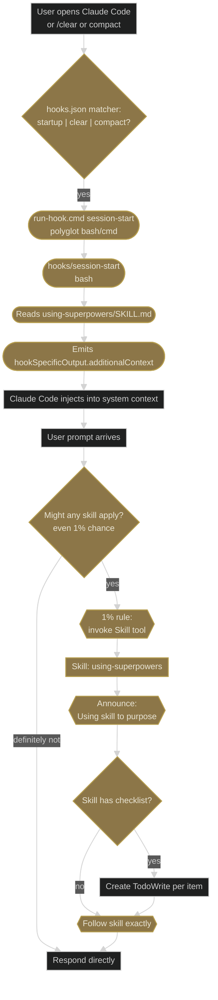

# Workflow 1 — Universal entry: what happens the moment any prompt arrives

**Trigger shape:** every prompt, no exceptions. Session start, `/clear`, and auto-compact also re-fire this chain.

**Audit verdict:** PASS against superpowers 5.0.7. No corrections.

## Layer 1 — superpowers core flow

## Key gates and Iron Laws

- The `SessionStart` hook is the **only** piece that runs outside the model. It re-injects `using-superpowers` as system context after every `/clear` or compact.
- **1% rule:** if any skill *might* apply, invoke it. Rationalizing past this is the defining risk the `using-superpowers` skill guards against.
- **Priority order:** user instructions (CLAUDE.md, direct requests) > superpowers skills > default system prompt.

## No layer 2

No global-plugin skill attaches at this workflow. Everything global-plugin ships lives downstream of the gate in Workflows 2, 3, 4, 5, 6, 7.

## Compatibility notes for new skills

- A new skill must not register a `SessionStart` hook that competes with `using-superpowers` for `additionalContext`. As of 0.4.0, global-plugin ships SessionStart and UserPromptSubmit hooks that DO emit a brief `additionalContext` payload (a skill-loading-discipline reminder); a new skill registering its own injection must coordinate with both this gate and the existing global-plugin injector.
- A new skill must not alter the 1%-rule behaviour. It must sit downstream of invocation, not inside it.
- A new skill's `description` must not be so broad that `using-superpowers` invokes it on every prompt — that would defeat the 1% discretion built into the gate.
