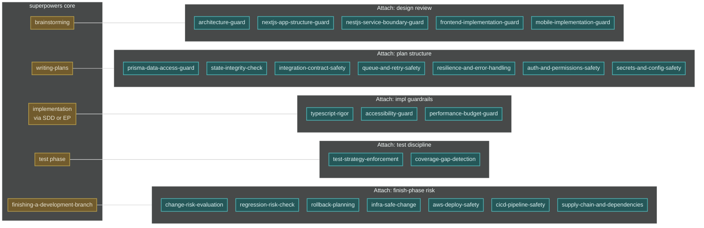

# Workflow 2 — Creative work: "build / add / create X"

**Trigger shape:** user wants new code written. Anything from a single function to a full subsystem.

**Audit verdict:** PASS against superpowers 5.0.7. No corrections.

## Layer 1 — superpowers core flow

```mermaid
%%{init: {'theme':'dark','themeVariables':{'fontSize':'11px'},'flowchart':{'nodeSpacing':20,'rankSpacing':26,'padding':4,'diagramPadding':4}}}%%
flowchart TD
    classDef extPlugin     fill:#785f28d9,stroke:#b49b4b,stroke-width:1.25px,color:#e9e5d5
    classDef companyPlugin fill:#1f5a5bd9,stroke:#4fb0b2,stroke-width:1.25px,color:#dff3f4
    classDef hook     fill:#785f28d9,stroke:#b49b4b,stroke-width:1.25px,color:#e9e5d5
    classDef rule     fill:#785f28d9,stroke:#b49b4b,stroke-width:1.25px,color:#e9e5d5
    classDef skill    fill:#785f28d9,stroke:#b49b4b,stroke-width:1.25px,color:#e9e5d5
    classDef agent    fill:#785f28d9,stroke:#b49b4b,stroke-width:1.25px,color:#e9e5d5
    classDef gate     fill:#785f28d9,stroke:#b49b4b,stroke-width:1.25px,color:#e9e5d5
    classDef artifact fill:#785f28d9,stroke:#b49b4b,stroke-width:1.25px,color:#e9e5d5

    P["User: build a CLI that watches<br/>a directory and uploads to S3"]

    P --> G1{"Gate from Workflow 1:<br/>might a skill apply? YES"}
    G1 --> BR[Skill: brainstorming]

    BR --> BR1[Explore project context]
    BR1 --> BR2[Offer Visual Companion<br/>if visuals ahead]
    BR2 --> BR3[Clarifying questions<br/>one at a time]
    BR3 --> BR4[Propose 2–3 approaches]
    BR4 --> BR5[Present design in sections]
    BR5 --> BR6[("Design doc<br/>docs/superpowers/specs/...")]
    BR6 --> BR7[Spec self-review]
    BR7 --> BR8[User reviews spec]
    BR8 --> HG{{"HARD-GATE<br/>spec approved?"}}
    HG -- no --> BR5
    HG -- yes --> WT[Skill: using-git-worktrees]

    WT --> WT1[Pick worktree dir]
    WT1 --> WT2[Verify .gitignore covers it]
    WT2 --> WT3[("git worktree add + new branch")]
    WT3 --> WT4[Auto-detect + run setup]
    WT4 --> WT5[Baseline tests must be green]

    WT5 --> WP[Skill: writing-plans]
    WP --> WP1[Map file structure]
    WP1 --> WP2[Decompose into 2–5 min tasks<br/>failing test, impl, verify, commit]
    WP2 --> WP3[("Plan<br/>docs/superpowers/plans/...")]
    WP3 --> WP4[Self-review]

    WP4 --> CHOICE{Execution choice}
    CHOICE -- recommended --> SDD[Skill: subagent-driven-development]
    CHOICE -- alternative --> EP[Skill: executing-plans]

    SDD --> FIN[Skill: finishing-a-development-branch]
    EP --> FIN
    FIN --> FIN1[Verify full test suite]
    FIN1 --> FIN2{Present 4 options}
    FIN2 -- 1 --> OPT1[Merge locally]
    FIN2 -- 2 --> OPT2[Push + gh pr create]
    FIN2 -- 3 --> OPT3[Keep as-is]
    FIN2 -- 4 --> OPT4[Discard]

    class BR,WT,WP,SDD,EP,FIN skill
    class BR,WT,WP,SDD,EP,FIN extPlugin
    class G1,HG,CHOICE,FIN2 gate
    class BR6,WP3,WT3 artifact
    class BR6,WP3,WT3 extPlugin
    class HG rule
```

## Key gates and Iron Laws

- **HARD-GATE:** no code until the spec is approved. This is the gate every global-plugin guard skill must respect.
- **Worktree required:** no implementation actions until `using-git-worktrees` has run and baseline tests are green.
- **Execution choice is binary**: `subagent-driven-development` (recommended) or `executing-plans` (alternative). No third path.
- **Finishing is explicit**: agent presents 4 options; user chooses. Do not auto-merge.

## Layer 2 — where global-plugin skills attach

### Attach-point table

| Phase | Company-plugin skills | Mode | Trigger condition |
|---|---|---|---|
| Design review (inside `brainstorming`) | `architecture-guard` | guide + review | Design spans modules or touches boundaries |
| Design review | `nextjs-app-structure-guard` | guide + review | Frontend Next.js work |
| Design review | `nestjs-service-boundary-guard` | guide + review | Backend NestJS work |
| Design review | `frontend-implementation-guard` | guide + review | Any UI change |
| Design review | `mobile-implementation-guard` | guide + review | React Native change |
| Plan structure (inside `writing-plans`) | `prisma-data-access-guard` | guide + review | DB access in plan |
| Plan structure | `state-integrity-check` | guide + review | Client/server state involved |
| Plan structure | `integration-contract-safety` | guide + review | API / webhook / event contracts |
| Plan structure | `queue-and-retry-safety` | guide + review | Queue consumer/producer |
| Plan structure | `resilience-and-error-handling` | guide + review | Any network-boundary code |
| Plan structure | `auth-and-permissions-safety` | guide + review | Auth-touching code |
| Plan structure | `secrets-and-config-safety` | guide + review | Secrets or env config |
| Implementation guardrail | `typescript-rigor` | guide | Always |
| Implementation guardrail | `accessibility-guard` | guide + review | UI change |
| Implementation guardrail | `performance-budget-guard` | guide + review | UI or DB-touching |
| Test discipline | `test-strategy-enforcement` | guide | Any test added or touched |
| Test discipline | `coverage-gap-detection` | review | Before finishing |
| Finish-phase risk | `change-risk-evaluation` | review | Always |
| Finish-phase risk | `regression-risk-check` | review | Always |
| Finish-phase risk | `rollback-planning` | review | Always |
| Finish-phase risk | `infra-safe-change` | guide + review | IaC touched |
| Finish-phase risk | `aws-deploy-safety` | guide + review | AWS deploy touched |
| Finish-phase risk | `cicd-pipeline-safety` | guide + review | Workflow files touched |
| Finish-phase risk | `supply-chain-and-dependencies` | review | Dependencies added / updated |

## Compatibility notes

- **Respect the HARD-GATE.** A design-review guard must not produce implementation code or scaffolding — it is read-only during `brainstorming`.
- **Do not duplicate TDD or verification.** A test-discipline skill references `**REQUIRED SUB-SKILL:** superpowers:test-driven-development`; it does not restate RED-GREEN-REFACTOR.
- **Review-mode output goes to the reviewer consumer.** Finish-phase skills fire through Workflow 6 (review loop); their output must match the `code-reviewer` report shape so they can be consumed side-by-side.
- **No cross-phase invocation.** A guard defined as design-review only must not invoke itself during impl guardrail phase — that would create duplicate noise.
- **Use the `description` `Do NOT use for` field** to list the phases where the skill must stay silent.
