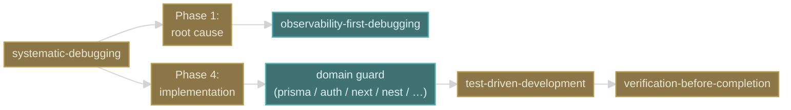

# Workflow 3 — Bug path: "the app crashes / test fails / regression"

**Trigger shape:** user reports a defect, test failure, crash, or unexpected behaviour.

**Audit verdict:** PASS against superpowers 5.0.7. No corrections. Iron Law phrasings are clean paraphrases of the source (e.g. diagram's "NO FIXES WITHOUT ROOT CAUSE" ≈ source's "NO FIXES WITHOUT ROOT CAUSE INVESTIGATION FIRST").

## Layer 1 — superpowers core flow

```mermaid
%%{init: {'theme':'dark','themeVariables':{'fontSize':'11px'},'flowchart':{'nodeSpacing':20,'rankSpacing':26,'padding':4,'diagramPadding':4}}}%%
flowchart TD
    classDef extPlugin     fill:#785f28d9,stroke:#b49b4b,stroke-width:1.25px,color:#e9e5d5
    classDef companyPlugin fill:#1f5a5bd9,stroke:#4fb0b2,stroke-width:1.25px,color:#dff3f4
    classDef rule     fill:#785f28d9,stroke:#b49b4b,stroke-width:1.25px,color:#e9e5d5
    classDef skill    fill:#785f28d9,stroke:#b49b4b,stroke-width:1.25px,color:#e9e5d5
    classDef gate     fill:#785f28d9,stroke:#b49b4b,stroke-width:1.25px,color:#e9e5d5

    P["User: app crashes when<br/>uploading a file over 10MB"]

    P --> G1{"Gate from Workflow 1 → YES"}
    G1 --> SD[Skill: systematic-debugging]
    SD --> IL1{{"Iron Law:<br/>NO FIXES WITHOUT ROOT CAUSE"}}

    IL1 --> PH1[Phase 1 — Root Cause]
    PH1 --> PH1a[Read errors carefully]
    PH1a --> PH1b[Reproduce consistently]
    PH1b --> PH1c[Check recent changes]
    PH1c --> PH1d{Multi-component?}
    PH1d -- yes --> PH1e[Instrument each boundary]
    PH1d -- no --> PH1f[Trace data flow backward]
    PH1e --> PH2
    PH1f --> PH2

    PH2[Phase 2 — Pattern]
    PH2 --> PH2a[Find similar working code]
    PH2a --> PH2b[List every difference]
    PH2b --> PH3

    PH3[Phase 3 — Hypothesis]
    PH3 --> PH3a[I think X because Y]
    PH3a --> PH3b[Smallest possible test]
    PH3b --> PH3c{Confirmed?}
    PH3c -- no --> PH3d[New hypothesis<br/>don't stack fixes]
    PH3d --> PH3a
    PH3c -- yes --> PH4

    PH4[Phase 4 — Implementation]
    PH4 --> TDD[Skill: test-driven-development]
    TDD --> IL2{{"Iron Law:<br/>NO CODE WITHOUT FAILING TEST"}}
    IL2 --> TDD1[RED: failing test for the bug]
    TDD1 --> TDD2[Verify fails for right reason]
    TDD2 --> TDD3[GREEN: minimal fix]
    TDD3 --> TDD4[All tests still pass]
    TDD4 --> TDD5[REFACTOR stay green]

    TDD5 --> VB[Skill: verification-before-completion]
    VB --> IL3{{"Iron Law:<br/>NO CLAIM WITHOUT FRESH EVIDENCE"}}
    IL3 --> VB1[Identify command that proves fix]
    VB1 --> VB2[Run fresh, read output]
    VB2 --> VB3{Output confirms?}
    VB3 -- no --> TDD3
    VB3 -- yes --> DONE[State result with evidence]

    PH3c -. 3+ failures .-> FAIL{{"STOP<br/>question architecture"}}

    class SD,TDD,VB skill
    class SD,TDD,VB extPlugin
    class IL1,IL2,IL3,FAIL rule
    class IL1,IL2,IL3,FAIL extPlugin
    class G1,PH1d,PH3c,VB3 gate
```

## Key gates and Iron Laws

- **IL1: NO FIXES WITHOUT ROOT CAUSE.** Phase 1 must complete before any code change.
- **IL2: NO CODE WITHOUT FAILING TEST.** Phase 4 opens with a RED regression test, never a fix.
- **IL3: NO CLAIM WITHOUT FRESH EVIDENCE.** Exit gate — verification output must be read, this message.
- **Escape hatch:** 3+ failed fix attempts ⇒ STOP, the architecture is suspect. This is an explicit deliberate loop-break.

## Layer 2 — where company-plugin skills attach

### Attach-point table

| Phase | Company-plugin skills | Mode | Trigger condition |
|---|---|---|---|
| Phase 1 — Root Cause | `observability-first-debugging` | guide | Any production / integration bug where logs, metrics, or traces exist |
| Phase 4 — Implementation | whichever domain guard matches the bug location | guide | Query bug → `prisma-data-access-guard`; auth bug → `auth-and-permissions-safety`; cache bug → `state-integrity-check`; etc. |

## Compatibility notes

- **Do not replace TDD.** A bug-path skill must never say "quick one-line fix, skip the test". The IL2 Iron Law owns this.
- **Do not shortcut Phase 1.** `observability-first-debugging` adds the "check logs/metrics/traces before guessing" discipline, but it does not let Claude skip to Phase 4 — it is *within* Phase 1.
- **Preserve the 3+ escape hatch.** If a company-plugin skill triggers a 3rd failed fix, the skill must explicitly surface `STOP, question architecture` rather than continue.
- **Exit through IL3.** Any bug-fix skill ends by deferring to `verification-before-completion`, not by declaring success on its own.
