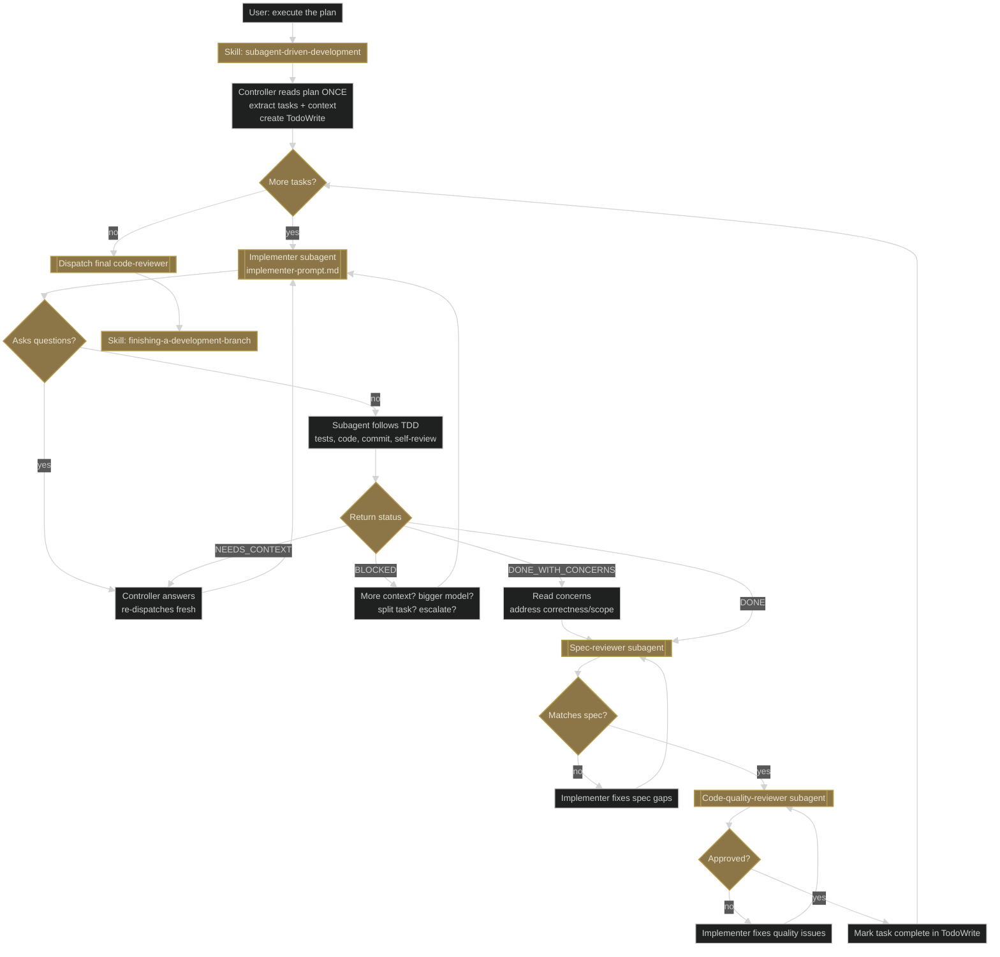

# Workflow 4 — Subagent execution: "execute the plan" (inside subagent-driven-development)

**Trigger shape:** a written plan from Workflow 2 is ready; user chose the recommended execution path.

**Audit verdict:** PASS against superpowers 5.0.7. No corrections. Two-stage review order (spec-reviewer before code-quality-reviewer) verified in `subagent-driven-development/SKILL.md`. All three prompt templates (`implementer-prompt.md`, `spec-reviewer-prompt.md`, `code-quality-reviewer-prompt.md`) exist in the skill folder.

## Layer 1 — superpowers core flow

## Key gates and Iron Laws

- **Two-stage review is ordered.** Spec compliance first, code quality second. Running quality review on work that does not match the spec wastes a cycle.
- **Controller never reads the plan inside subagent prompts.** It extracts task text and hands the subagent only what it needs. This keeps subagent contexts small and independent.
- **Model tiering** (cheap for mechanical, standard for integration, top-tier for architecture) is an explicit part of the skill.

## Layer 2 — company-plugin guardrail cluster (inside Implementer)

```mermaid
%%{init: {'theme':'dark','themeVariables':{'fontSize':'11px'},'flowchart':{'nodeSpacing':16,'rankSpacing':22,'padding':4,'diagramPadding':4}}}%%
flowchart LR
    classDef extPlugin     fill:#785f28d9,stroke:#b49b4b,stroke-width:1.25px,color:#e9e5d5
    classDef companyPlugin fill:#1f5a5bd9,stroke:#4fb0b2,stroke-width:1.25px,color:#dff3f4

    IMP[[Implementer subagent]]:::extPlugin

    subgraph GUARD[Guardrail cluster — guide mode inside Implementer context]
        TS[typescript-rigor]:::companyPlugin
        A11Y[accessibility-guard]:::companyPlugin
        PERF[performance-budget-guard]:::companyPlugin
        RES[resilience-and-error-handling]:::companyPlugin
        AUTH[auth-and-permissions-safety]:::companyPlugin
        SEC[secrets-and-config-safety]:::companyPlugin
        PRIS[prisma-data-access-guard]:::companyPlugin
        STATE[state-integrity-check]:::companyPlugin
        TSE[test-strategy-enforcement]:::companyPlugin
    end

    IMP --- GUARD
```

### Attach-point table

| Phase | Company-plugin skill | Mode | Trigger condition |
|---|---|---|---|
| Inside Implementer subagent context | `typescript-rigor` | guide | Always |
| Inside Implementer | `accessibility-guard` | guide | UI file touched |
| Inside Implementer | `performance-budget-guard` | guide | UI file touched or DB query added |
| Inside Implementer | `resilience-and-error-handling` | guide | Network-boundary code added |
| Inside Implementer | `auth-and-permissions-safety` | guide | Authz-touching code added |
| Inside Implementer | `secrets-and-config-safety` | guide | Secrets or env config touched |
| Inside Implementer | `prisma-data-access-guard` | guide | Prisma query, schema, or migration touched |
| Inside Implementer | `state-integrity-check` | guide | Client/server state boundary touched |
| Inside Implementer | `test-strategy-enforcement` | guide | Test file added or touched |

## Compatibility notes

- **Guardrails fire inside the subagent, not in the controller.** The controller must never read or list them — they should be part of the Implementer's own skill discovery via `using-superpowers`' 1% rule.
- **No guardrail competes with TDD.** Each guardrail adds domain rules on top of TDD; none of them replaces "write the failing test first".
- **Guardrail output feeds the spec-reviewer via the code itself.** Guardrails do not emit separate reports to the controller; their work shows up as better code for the spec-reviewer and code-quality-reviewer subagents to read.
- **A new company-plugin skill targeting this workflow must be addable to the guardrail cluster without modifying the three prompt templates.** If a new skill requires a new prompt field, that is a breaking change and warrants discussion before committing.
