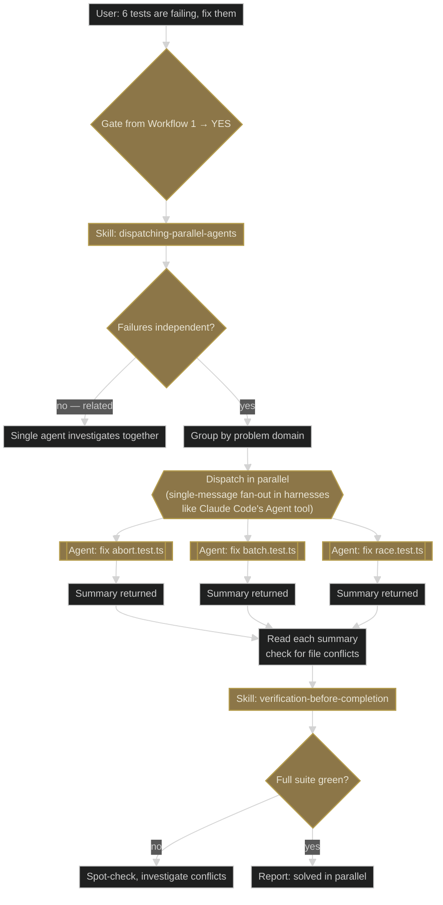

# Workflow 5 — Parallel agents: "fix these N independent tests"

**Trigger shape:** user asks for several independent fixes / investigations at once. Not executing a written plan (that is Workflow 4).

**Audit verdict:** CORRECTIONS NEEDED. One item applied inline below — see §Correction applied.

## Correction applied

The original reference (superpowers.md Diagram 5) contained a rule node labelled `{{"Fan out — ALL Task calls in ONE message"}}`. The superpowers 5.0.7 source `skills/dispatching-parallel-agents/SKILL.md` talks about parallel dispatch and per-agent constraints but **does not** contain the literal phrase "ALL Task calls in ONE message" or equivalent. The claim is a harness-specific implementation detail (Claude Code's `Agent` tool processes parallel tool-use content blocks in one assistant message), not a skill-level rule.

The diagram below softens the wording to describe the spirit faithfully.

## Layer 1 — superpowers core flow

## Key gates and Iron Laws

- **Triage first.** Related failures get one agent (fixing one may fix all). Only independent domains get parallelized.
- **Per-agent constraints.** Each parallel agent gets a narrow scope, explicit "don't touch other code", and a defined return format.
- **Full-suite verification at the end.** `verification-before-completion` catches cross-parallel conflicts that each agent individually missed.

## Layer 2 — minimal

### Attach-point table

| Phase | Company-plugin skill | Mode | Trigger condition |
|---|---|---|---|
| Inside each parallel agent's scope | any domain guard that fits the narrow task | guide | Same criteria as Workflow 4's guardrail cluster, scoped down |
| After full-suite verification | `change-risk-evaluation` | review | Always — flags whether any of the parallel fixes expanded blast radius unexpectedly (covers blast-radius analysis as part of its consolidated scope in 0.4.0) |

## Compatibility notes

- **Parallel agents are narrow by design.** A global-plugin skill that wants to fire inside a parallel agent must fit in a reduced context — prefer the smallest possible guide rather than a full review.
- **Cross-agent regression is the real risk.** A new parallel-friendly skill should include a rule that references `change-risk-evaluation` via `**Hands off to:** global-plugin:change-risk-evaluation` when post-parallel verification is the right consumer (the skill covers blast-radius analysis as well as risk posture and rollback).
- **Do not add a per-agent review step.** Per-task review belongs in Workflow 4. This workflow is about fan-out, not gating.
