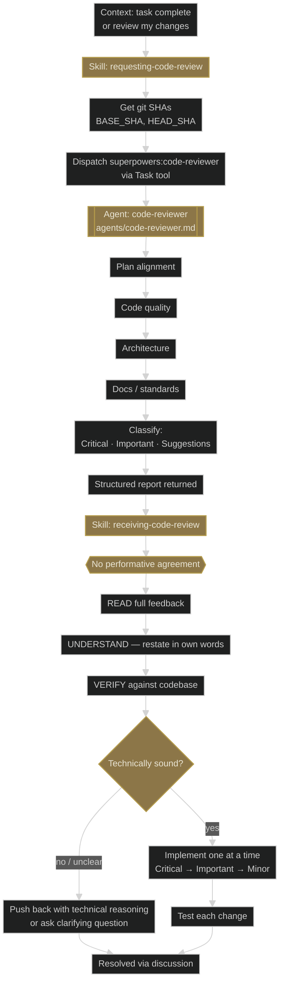
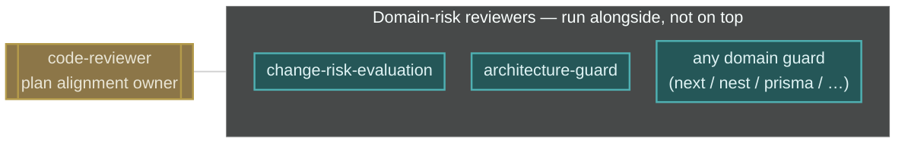

# Workflow 6 — Review loop: requesting + receiving code review

**Trigger shape:** a task is complete, or user asks for a review before merge.

**Audit verdict:** PASS against superpowers 5.0.7. `agents/code-reviewer.md` covers plan alignment, code quality, architecture, docs/standards, and Critical/Important/Suggestions classification. `receiving-code-review` explicitly forbids performative agreement ("You're absolutely right!" marked as a violation).

## Layer 1 — superpowers core flow

## Key gates and Iron Laws

- The superpowers `code-reviewer` is the **only dedicated subagent** the plugin ships. Everything else in superpowers is a `Task` dispatch with a prompt template.
- **No performative agreement.** `receiving-code-review` forbids phrases like "You're absolutely right!" because review feedback tends to produce sycophantic drift.
- **Push-back is structurally encouraged** when the reviewer is wrong — via technical reasoning, not capitulation.

## Layer 2 — where global-plugin skills attach

### Attach-point table

| Phase | Company-plugin skill | Mode | Owner concern |
|---|---|---|---|
| Alongside `code-reviewer` | `change-risk-evaluation` | review | Overall risk posture, blast radius on changed surface, and reverse path for the change (consolidated in 0.4.0 from prior `change-risk-evaluation` + `regression-risk-check` + `rollback-planning`) |
| Alongside `code-reviewer` | `architecture-guard` | review | Cross-service boundaries / monorepo ownership |
| Alongside `code-reviewer` | `nextjs-app-structure-guard`, `nestjs-service-boundary-guard`, `frontend-implementation-guard`, `mobile-implementation-guard` | review | Intra-app structure matching the changed files |
| Alongside `code-reviewer` | `prisma-data-access-guard`, `state-integrity-check`, `integration-contract-safety`, `queue-and-retry-safety`, `resilience-and-error-handling`, `auth-and-permissions-safety`, `secrets-and-config-safety` | review | Domain-specific risk for the affected subsystem |
| Alongside `code-reviewer` | `coverage-gap-detection`, `supply-chain-and-dependencies` | review | Quality and supply-chain posture |
| Alongside `code-reviewer` | `infra-safe-change`, `aws-deploy-safety`, `cicd-pipeline-safety` | review | Infra / deploy / pipeline files |

## Compatibility notes

- **The `code-reviewer` owns plan alignment.** Company-plugin review skills own **domain risk**. Their outputs **sit alongside**, not on top. If a global-plugin skill tries to re-grade plan alignment, it duplicates the agent.
- **Report-shape must match the guide.** `docs/superpowers/skill-authoring-guide.md` specifies a four-section markdown report: Summary, Findings (file:line, severity, category, fix), Safer alternative, Checklist coverage (PASS / CONCERN / NOT APPLICABLE). Every review-mode global-plugin skill must produce this shape.
- **Grading vocabulary is `PASS / CONCERN / NOT APPLICABLE`.** Not GREEN/YELLOW/RED, not OK/WARN/ERROR. The per-skill audit (`docs/superpowers/audits/2026-04-22/*.md`) uses GREEN/YELLOW/RED at the **skill-audit level** (for compatibility verdicts), but individual review checklists inside a SKILL must use the three sanctioned labels.
- **Review mode is read-only.** A skill in review mode does not call Edit, Write, or Bash for state-changing commands. Only Read, Grep, Glob, Bash for read-only probes.
- **Push-back on the superpowers reviewer is encouraged** per `receiving-code-review`. A global-plugin skill must not teach the user to "just apply the reviewer's suggestion" — it must defer to the receiver skill's rule that verification comes first.
