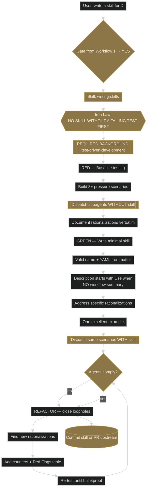
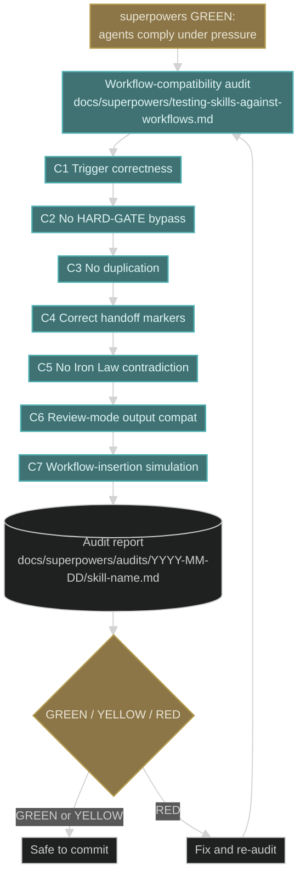

# Workflow 7 — Writing or editing a skill

**Trigger shape:** user asks to create a new skill or modify an existing one.

**Audit verdict:** PASS against superpowers 5.0.7. Iron Law `NO SKILL WITHOUT A FAILING TEST FIRST` is literally in `writing-skills/SKILL.md` line 377. RED-GREEN-REFACTOR and pressure-scenario testing fully documented in the skill and its companion `testing-skills-with-subagents.md`.

## Layer 1 — superpowers core flow

## Key gates and Iron Laws

- **IL: NO SKILL WITHOUT A FAILING TEST FIRST.** You must run baseline scenarios **without** the skill and watch them fail before writing anything. Writing the skill first and testing after is the canonical violation.
- **REQUIRED BACKGROUND: `test-driven-development`.** Same RED-GREEN-REFACTOR discipline.
- **Description field is load-bearing.** A description that summarises the skill's workflow causes Claude to follow the description instead of reading the body. `writing-skills` has an entire CSO section on this.

## Layer 2 — global-plugin compatibility audit hook

### Attach-point table

| Phase | Artifact / skill | Mode | Trigger condition |
|---|---|---|---|
| After superpowers GREEN phase passes | `docs/superpowers/testing-skills-against-workflows.md` (audit template) | audit | Every new or edited global-plugin skill, without exception |
| Records | `docs/superpowers/audits/YYYY-MM-DD/<skill-name>.md` | artifact | Produced once per audit run |

## Compatibility notes

- **The workflow-compatibility audit is additive.** It runs **after** superpowers' RED-GREEN-REFACTOR passes — not instead of it. A skill with a great pressure-test record can still fail this audit, and vice versa. Both gates must pass before commit.
- **RED verdict blocks commit.** A skill with any C1–C7 FAIL cannot merge. A YELLOW verdict (CONCERN, no FAIL) can merge with an issue logged.
- **The audit template itself is a living document.** If, during piece #4's bulk audit, new systemic rationalizations surface, add them to the template as additional check rows and re-audit affected skills.
- **This workflow is the only place in global-plugin where the audit is explicitly invoked.** Don't fold it into Workflow 2 or 6 — skill authoring is a distinct activity and the audit belongs here.
