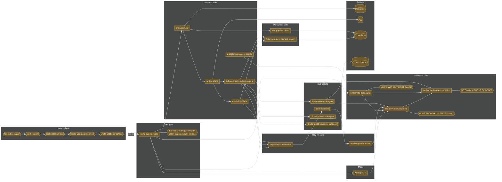
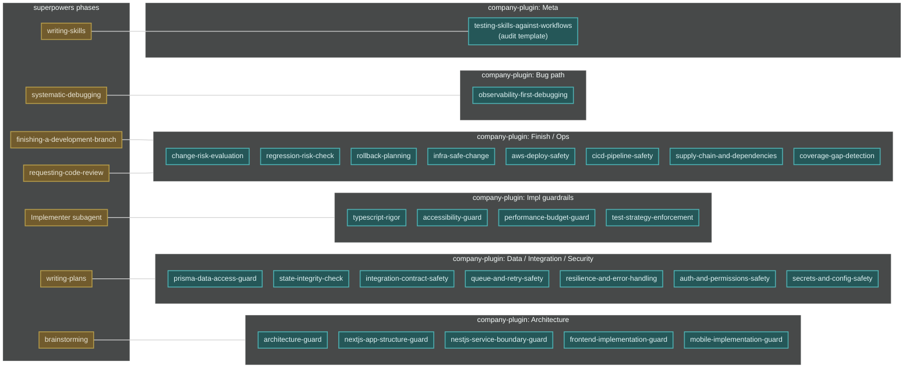

# Workflow 8 — The whole map

Reference diagram. Everything superpowers ships, plus the company-plugin overlay showing where our skills attach.

**Audit verdict:** PASS against superpowers 5.0.7. All hooks, skills, prompt templates, and cross-reference edges verified. No corrections.

## Layer 1 — superpowers only

## Layer 2 — the same map with company-plugin overlay

## Compatibility notes

- **Every arrow between a company-plugin cluster and a superpowers phase is an attachment, not a replacement.** The superpowers phase always owns the Iron Law; the company-plugin cluster adds domain rules on top.
- **The `_baseline` skill is implicit under every company-plugin cluster.** It is not drawn on the map because it would connect to every node. Assume it.
- **No company-plugin skill should span more than 3 phases.** A skill that claims to attach in design + impl + finish + review is too broad — split it.
