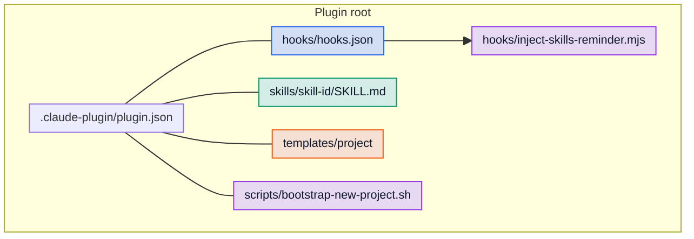
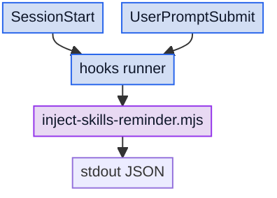
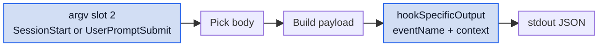
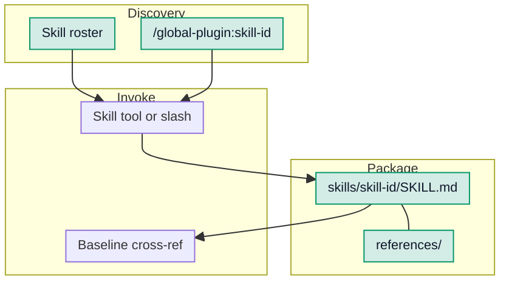
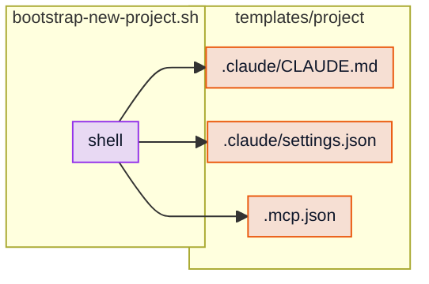
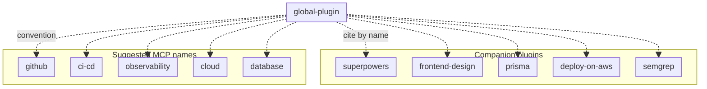
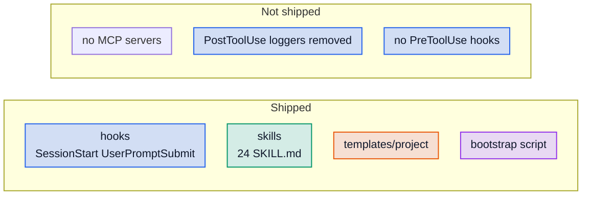

# global-plugin

Company-wide guardrails for full-stack React/Next.js + Node/NestJS + Prisma/Postgres + AWS projects.

> Note: a one-command new-project setup script is being reworked. The previous `plugin/scripts/bootstrap-new-project.sh` is still shipped but its templates have known issues (broken `.mcp.json` placeholders, CLAUDE.md template at a path Claude Code doesn't read). Pending follow-up release.

## Target stack

- React / Next.js
- Node.js / NestJS / TypeScript
- Prisma + PostgreSQL
- AWS
- optional React Native mobile apps

## Included skills

Each skill is self-contained — no cross-references to anything outside the plugin. Skills hold their own domain rules; cross-cutting expectations like TypeScript strictness, security defaults, structured observability, and the test pyramid are in the model's training as canonical defaults rather than restated here.

<table>
<thead>
<tr>
<th align="left">Category</th>
<th align="left">Skill</th>
<th align="left">Description</th>
</tr>
</thead>
<tbody>
<tr style="background-color: rgba(67, 84, 122, 0.29);">
<td>Architecture &amp; structure</td>
<td><code>architecture-guard</code></td>
<td>Monorepo boundaries, dependency direction, shared packages, and cross-service contracts when structure changes.</td>
</tr>
<tr style="background-color: rgba(67, 84, 122, 0.29);">
<td>Architecture &amp; structure</td>
<td><code>nextjs-app-structure-guard</code></td>
<td>Next.js App Router: RSC vs client, routes, middleware, server actions, streaming, and caching.</td>
</tr>
<tr style="background-color: rgba(67, 84, 122, 0.29);">
<td>Architecture &amp; structure</td>
<td><code>nestjs-service-boundary-guard</code></td>
<td>NestJS modules, controllers, providers, DTOs, transactions, and intra-app service boundaries.</td>
</tr>
<tr style="background-color: rgba(67, 84, 122, 0.29);">
<td>Architecture &amp; structure</td>
<td><code>frontend-implementation-guard</code></td>
<td>React components, hooks, state placement, composition, and component-level data flow.</td>
</tr>
<tr style="background-color: rgba(67, 84, 122, 0.29);">
<td>Architecture &amp; structure</td>
<td><code>mobile-implementation-guard</code></td>
<td>React Native / Expo screens, navigation, native modules, EAS build/update, and offline UX.</td>
</tr>
<tr style="background-color: rgba(71, 106, 105, 0.29);">
<td>Data</td>
<td><code>prisma-data-access-guard</code></td>
<td>Prisma queries, schema, migrations, transactions, indexes, N+1, and raw SQL safety.</td>
</tr>
<tr style="background-color: rgba(71, 106, 105, 0.29);">
<td>Data</td>
<td><code>state-integrity-check</code></td>
<td>Cache invalidation, optimistic updates, and server/client state consistency when writes touch the UI.</td>
</tr>
<tr style="background-color: rgba(120, 96, 68, 0.29);">
<td>Integration &amp; async</td>
<td><code>integration-contract-safety</code></td>
<td>Public HTTP APIs, webhooks, events, versioning, breaking changes, and consumer migration.</td>
</tr>
<tr style="background-color: rgba(120, 96, 68, 0.29);">
<td>Integration &amp; async</td>
<td><code>queue-and-retry-safety</code></td>
<td>SQS/EventBridge/queues: at-least-once semantics, idempotency, DLQ, visibility, ordering.</td>
</tr>
<tr style="background-color: rgba(120, 96, 68, 0.29);">
<td>Integration &amp; async</td>
<td><code>resilience-and-error-handling</code></td>
<td>Timeouts, retries with jitter, circuit breaking, error boundaries, idempotent external calls.</td>
</tr>
<tr style="background-color: rgba(121, 74, 81, 0.29);">
<td>Security &amp; config</td>
<td><code>auth-and-permissions-safety</code></td>
<td>AuthN/session/token flows, RBAC/ABAC, permission checks on routes and data access.</td>
</tr>
<tr style="background-color: rgba(121, 74, 81, 0.29);">
<td>Security &amp; config</td>
<td><code>secrets-and-config-safety</code></td>
<td>Env vars, secrets, multi-environment config, client vs server env boundaries.</td>
</tr>
<tr style="background-color: rgba(93, 79, 119, 0.29);">
<td>Quality</td>
<td><code>typescript-rigor</code></td>
<td>Strict typing, generics, DTOs, discriminated unions, branded types, and boundary parsing.</td>
</tr>
<tr style="background-color: rgba(93, 79, 119, 0.29);">
<td>Quality</td>
<td><code>test-strategy-enforcement</code></td>
<td>Test pyramid, unit vs integration vs e2e, flakes, mocks vs real services, test data strategy.</td>
</tr>
<tr style="background-color: rgba(93, 79, 119, 0.29);">
<td>Quality</td>
<td><code>coverage-gap-detection</code></td>
<td>Find critical untested paths, negative cases, and error branches before merge.</td>
</tr>
<tr style="background-color: rgba(81, 110, 88, 0.29);">
<td>Frontend quality</td>
<td><code>accessibility-guard</code></td>
<td>WCAG-oriented a11y: keyboard, focus, ARIA, contrast, reduced motion, forms.</td>
</tr>
<tr style="background-color: rgba(81, 110, 88, 0.29);">
<td>Frontend quality</td>
<td><code>performance-budget-guard</code></td>
<td>Core Web Vitals, bundle budgets, hot-path latency, memoization, streaming, caching layers.</td>
</tr>
<tr style="background-color: rgba(84, 89, 115, 0.29);">
<td>Ops &amp; risk</td>
<td><code>change-risk-evaluation</code></td>
<td>Risk rating, blast radius, deploy strategy, monitoring signals, rollback and stakeholder comms.</td>
</tr>
<tr style="background-color: rgba(84, 89, 115, 0.29);">
<td>Ops &amp; risk</td>
<td><code>infra-safe-change</code></td>
<td>IaC (Terraform/CDK/etc.): plans, state, IAM, networking, destructive change detection.</td>
</tr>
<tr style="background-color: rgba(84, 89, 115, 0.29);">
<td>Ops &amp; risk</td>
<td><code>aws-deploy-safety</code></td>
<td>AWS runtime deploys: ECS/Lambda/App Runner, roles, secrets wiring, health checks, rollout strategies.</td>
</tr>
<tr style="background-color: rgba(84, 89, 115, 0.29);">
<td>Ops &amp; risk</td>
<td><code>cicd-pipeline-safety</code></td>
<td>CI workflows (e.g. GitHub Actions): OIDC, secrets, required checks, promotion, action pinning.</td>
</tr>
<tr style="background-color: rgba(84, 89, 115, 0.29);">
<td>Ops &amp; risk</td>
<td><code>supply-chain-and-dependencies</code></td>
<td>Dependencies: upgrades, lockfiles, CVEs, licenses, pinning, typosquat awareness.</td>
</tr>
<tr style="background-color: rgba(84, 89, 115, 0.29);">
<td>Ops &amp; risk</td>
<td><code>observability-first-debugging</code></td>
<td>Logs/metrics/traces-first debugging, structured logging, correlation IDs, alarms.</td>
</tr>
<tr style="background-color: rgba(105, 88, 103, 0.29);">
<td>Maintainer / experimental</td>
<td><code>anthropic-tooling-dev</code></td>
<td>Guidance for Claude Code harness work: plugins, skills, hooks, agents, MCP, Agent SDK.</td>
</tr>
</tbody>
</table>

Rows that share the same **category** share the same background tint (ordered top-to-bottom by category).

## Visual architecture (diagrams)

The sections below map how the plugin is laid out on disk, when hooks run relative to user input, how reminders are produced, how skills relate to slash commands and supporting files, what shipped templates and scripts do, and how optional companions fit in. Expand each block to view the diagram. Diagrams share compact **font/spacing** init (the hook timeline uses slightly tighter spacing). Each flowchart defines **`classDef`** styles **`hooks`**, **`scripts`**, **`skills`**, **`templates`**. **Hooks** matches **`rgba(30, 90, 200, 0.2)`** over white; the others use the same **0.2 alpha** on saturated purple / teal / amber hues. Mermaid **`classDef`** cannot parse comma-containing **`rgba(...)`**, so node **`fill`** uses **solid hex** equivalent to blending each **`rgba`** over **white** (same perceived pastel). **`color`** is **`#0f172a`** on shapes for readable labels; **`stroke`** uses a deeper hue-aligned hex per category.

<details>
<summary>Plugin bundle layout (filesystem)</summary>



</details>

<details>
<summary>Hook events and user prompt timeline</summary>



</details>

<details>
<summary>Reminder script output shape</summary>



</details>

<details>
<summary>From discovered skill to invocation</summary>



</details>

<details>
<summary>Bootstrap script and shipped project templates</summary>



</details>

<details>
<summary>Optional companions and MCP conventions</summary>



</details>

<details>
<summary>0.4.0 surface vs removed / not shipped</summary>



</details>

## Included hooks

- **SessionStart** — injects a one-paragraph reminder of skill-loading discipline (use every relevant skill, name skills explicitly when dispatching subagents).
- **UserPromptSubmit** — re-emits the same reminder as a one-line reinforcement on every prompt.

The previous timestamp loggers (PostToolUse Write/Edit, SessionStart) and the per-prompt full-roster injection were removed in 0.4.0.

## Recommended companion plugins

`global-plugin` is designed to work alongside these plugins. Install them separately for full coverage:

```bash
claude plugin install superpowers --marketplace claude-plugins-official
claude plugin install frontend-design --marketplace claude-plugins-official
claude plugin install prisma --marketplace claude-plugins-official
claude plugin install deploy-on-aws --marketplace claude-plugins-official
claude plugin install semgrep --marketplace claude-plugins-official
```

These are recommendations, not enforced dependencies — the plugin works without them, but several skills cross-reference them by name. If a companion is not installed, those cross-references will be unresolved.

## MCP servers

`global-plugin` does not ship any MCP servers in 0.4.0. The previous `.mcp.json` shipped placeholder `echo` servers that broke `/mcp` for consumers and was removed.

If your project uses MCP servers, configure them in your project's own `.mcp.json`. Suggested server names that align with the plugin's guard skills:

- `github` — GitHub MCP server for repo introspection
- `ci-cd` — your CI/CD provider's MCP server (GitHub Actions, CircleCI, etc.)
- `observability` — your observability stack (Datadog, CloudWatch, etc.)
- `cloud` — your cloud provider (AWS)
- `database` — Postgres / Prisma MCP server

These are conventions, not requirements — the plugin's skills do not depend on any specific MCP server being present.

## Local test

```bash
claude --plugin-dir /absolute/path/to/global-plugin/plugin
```

Inside Claude Code:

- `/help`
- `/mcp`
- `/global-plugin:architecture-guard`
- `/global-plugin:frontend-implementation-guard`

For React Native projects, also use:

- `/global-plugin:mobile-implementation-guard`
